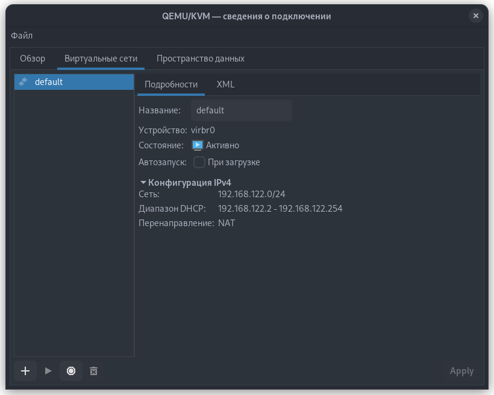
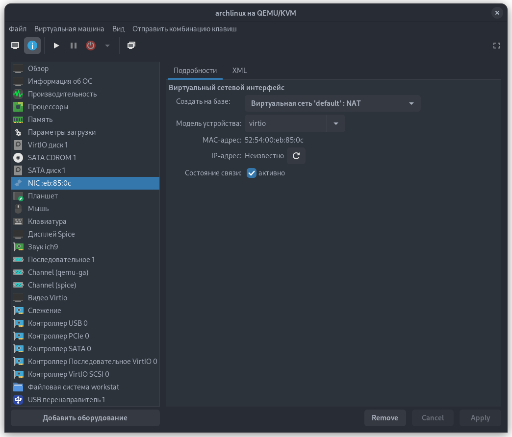
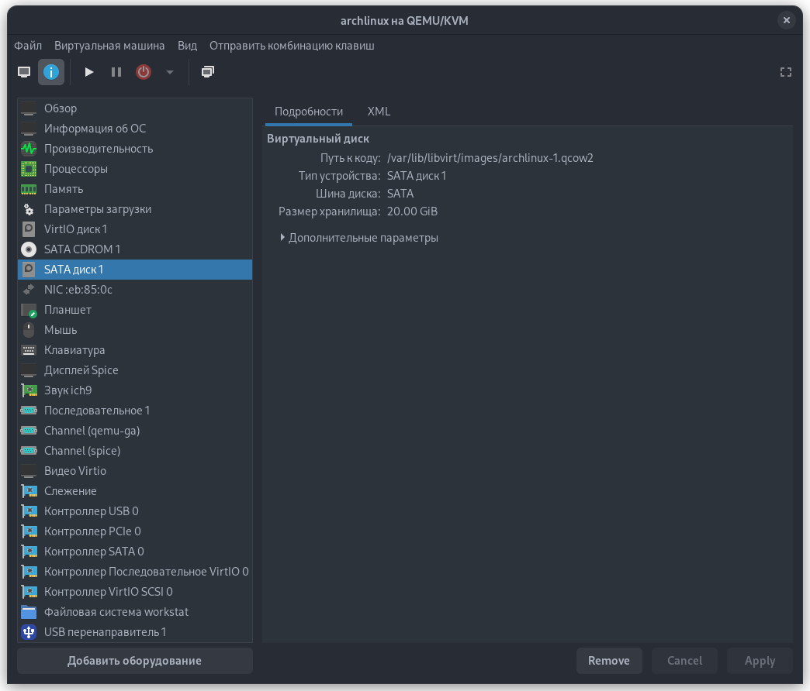

# Use QEMU/KVM and Virt Manager

Install `virt-manager` and `dnsmasq` (needed for create network):

```shell
sudo pacman -S virt-manager dnsmasq
```

Add your user to `libvirt` group:

```shell
sudo usermod -aG libvirt <username>
```

or

```shell
sudo gpasswd -a <username> libvirt
```

Enable `libvirtd.service`

```shell
sudo systemctl enable --now libvirtd.service
```

### Enable virtual network

Virtual network https://blog.programster.org/kvm-missing-default-network



## Virtual machine settings

### Setup machine network



### Setup disk



### Share host directory to guest OS

In this example we has `foo` user on host system and `bar` user on guest system. We want share host directory
`/home/foo/shared-dir` to `/home/bar/shared` directory in guest.

Memory: set `<access mode="shared"/>`

```xml
  <memoryBacking>
    <source type="memfd"/>
    <access mode="shared"/>
  </memoryBacking>
```

Add hardware -> Filesystem

- Driver: `virtiofs`
- Source path: path to host dir
- Target path: mount tag (`shared_dir` in this example)

```xml
<filesystem type="mount" accessmode="passthrough">
  <driver type="virtiofs"/>
  <binary path="/usr/lib/qemu/virtiofsd"/>
  <source dir="/home/foo/shared-dir"/>
  <target dir="shared_dir"/>
  <alias name="fs1"/>
  <address type="pci" domain="0x0000" bus="0x08" slot="0x00" function="0x0"/>
</filesystem>
```

On guest system

Create target dir:

```shell
mkdir ~/shared
```

Mount host dir tag to target dir:

```shell
sudo mount -t virtiofs shared_dir /home/bar/shared
```

If we want to make this permanent, we can just add an entry to `/etc/fstab`

```
shared_dir   /home/bar/shared      virtiofs        defaults        0       0
```

After rebooting, the share should be mounted! If your user on the host and the guest are the same, you don’t even need
to worry about any other permissions. Otherwise, change the folder with `chmod` to suit your needs.

## Links

- [Setting up virtual machines on Arch Linux | xHalford](https://www.xhalford.com/setting-up-virtual-machines-on-arch-linux/)
- [libvirt - ArchWiki](https://wiki.archlinux.org/title/Libvirt)
- [QEMU - ArchWiki](https://wiki.archlinux.org/title/QEMU)
- [File Sharing with Qemu and Virt-Manager](https://blog.sergeantbiggs.net/posts/file-sharing-with-qemu-and-virt-manager/)
- [libvirt: Sharing files with Virtiofs](https://libvirt.org/kbase/virtiofs.html)
